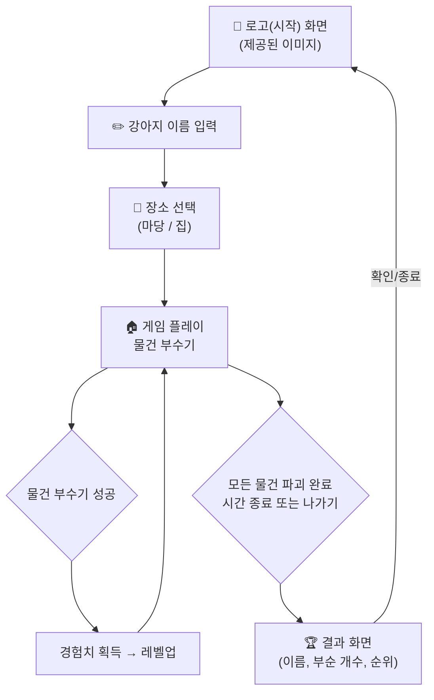

# 🐕 ROLLO - 부수기 게임 (Game Design Document)

> **장르**: 자유 부수기 (Destruction) 게임  
> **플랫폼**: 웹 브라우저 (PC + 태블릿)  
> **엔진**: HTML5 Canvas + Vanilla JavaScript  

---

## 1. 게임 개요

강아지 **ROLLO**가 정원이 있는 3층 주택에서 물건들을 자유롭게 부수는 게임.  
생명이나 아이템 없이, 순수하게 부수는 재미에 집중하는 캐주얼 게임입니다.

---

## 2. 게임 흐름



### 2.1 화면 전환 순서

| 순서 | 화면 | 설명 |
|------|------|------|
| 1 | **로고(시작) 화면** | 게임 첫 진입 시 제공된 로고 이미지 표시. 화면을 클릭하거나 시작 버튼을 눌러 다음으로 넘어감 |
| 2 | **이름 입력** | 강아지의 이름을 입력 (기본값: ROLLO) |
| 3 | **장소 선택** | "마당" 또는 "집" 중 하나를 선택 |
| 4 | **게임 플레이** | 선택한 장소에서 물건 부수기. 모든 물건 완파, 제한 시간 종료 또는 확인 후 나가기로 종료 |
| 5 | **결과 화면** | 최종 점수와 장소별 로컬 순위를 기록·표시. 확인 후 다시 **로고(시작) 화면**으로 돌아감 |

---

## 3. 주인공 - ROLLO 🐕

| 항목 | 설명 |
|------|------|
| **이름** | 플레이어가 입력 (기본값: ROLLO) |
| **외형** | 갈색+흰색 비글 스타일 강아지, 파란 목줄에 "R" 금색 목걸이 |
| **레벨 표시** | 캐릭터 머리 위에 현재 레벨이 항상 표시됨 |
| **시작 레벨** | 항상 **레벨 1**부터 시작 |
| **이동 방식** | PC: 키보드 방향키 / 태블릿: 화면 구석의 반투명 가상 방향키. 마우스·터치 위치 추적 이동은 사용하지 않음 |

### 3.1 ROLLO 동작 (Action) 시스템

- **바닥 고정 이동**: 강아지는 항상 맵의 1, 2, 3층 바닥이나 마당의 땅에 발을 붙이고 이동합니다. 공중이나 다른 층을 직접 지정해도 천장이나 바닥을 통과해 순간이동하지 않습니다.
- **층간 이동**: 강아지를 좌우 방향키로 계단 입구 바로 앞까지 직접 이동시켜야 합니다. 입구에서 ↑ 또는 ↓를 누르고 있는 동안 계단의 각 단을 Jump 동작으로 연속해서 오르거나 내려가며, 버튼을 놓으면 현재 진행 중인 한 단을 마친 뒤 멈춥니다.
- **가구 이동**: 올라갈 수 있도록 지정된 높은 가구에는 자동 점프로 올라갑니다. 발판이 된 가구가 파괴되면 강아지는 중력에 따라 가장 가까운 안전한 바닥으로 떨어집니다.

ROLLO는 **4가지 동작**을 가지며, 각 동작은 **3프레임 애니메이션**으로 구성됩니다.

| 동작 | 용도 | 프레임 수 | 설명 |
|------|------|----------|------|
| 🏃 **Running** | 이동 | 3프레임 | 달리는 모션. 입을 벌리고 신나게 뛰어다님 |
| 🦘 **Jump** | 높은 곳 이동 | 3프레임 | 계단 입구에서 ↑/↓를 입력해 한 단씩 올라가거나 내려갈 때 사용 |
| 💥 **Smashing** | 일반 공격 | 3프레임 | 앞발로 내려치는 모션. 물건을 부술 때 기본 공격 |
| 🔥 **Biting** | **필살기** | 3프레임 | 이빨로 물어뜯는 강력한 공격. 큰 폭발 이펙트 |

### 3.2 스프라이트 에셋

모든 스프라이트는 `image_sources/` 폴더에 저장됩니다.

강아지의 기본 표시 크기는 220px이며 레벨별 배율은 `Lv.1 60%(132px)`, `Lv.2 72.5%(159.5px)`, `Lv.3 85%(187px)`, `Lv.4 97.5%(214.5px)`, `Lv.5 110%(242px)`입니다. 이동속도와 계단 기준점은 크기와 관계없이 유지합니다.

강아지와 물건의 레벨 표시는 이름과 분리하여 `Lv.1 흰색(#FFFFFF)`, `Lv.2 민트(#8EF0A7)`, `Lv.3 하늘색(#65D6FF)`, `Lv.4 금색(#FFD45C)`, `Lv.5 분홍색(#FF7BD5)`을 사용합니다. 이름은 흰색으로 유지하고 전체 글자에 짙은 외곽선을 적용하여 밝고 복잡한 배경에서도 가독성을 확보합니다.

구현 시 강아지 스프라이트의 발밑 투명 여백을 상쇄하기 위해 화면 렌더링 위치에 레벨 배율을 반영한 `Y + 30px` 기준 보정을 적용합니다. 논리 이동 좌표와 계단 판정 좌표는 변경하지 않으며, 1·2·3층에서 동일한 바닥 밀착감을 유지합니다. 스매쉬와 필살기의 타격범위는 보이는 몸 앞에서 시작하고, Lv.1에서도 조작이 답답하지 않도록 X축 타격 거리는 최소 70px을 보장합니다.

```
image_sources/
├── dog_running_1.png    # Running 프레임 1 (앞발 앞으로)
├── dog_running_2.png    # Running 프레임 2 (네 발 모아 점프)
├── dog_running_3.png    # Running 프레임 3 (뒷발 킥)
├── dog_jumping_1.png    # Jump 프레임 1 (도약 준비)
├── dog_jumping_2.png    # Jump 프레임 2 (공중)
├── dog_jumping_3.png    # Jump 프레임 3 (착지)
├── dog_smashing_1.png   # Smashing 프레임 1 (앞발 들어올림)
├── dog_smashing_2.png   # Smashing 프레임 2 (앞발 뻗어 타격)
├── dog_smashing_3.png   # Smashing 프레임 3 (타격 완료, 충격파)
├── dog_biting_1.png     # Biting 프레임 1 (입 벌리며 돌진)
├── dog_biting_2.png     # Biting 프레임 2 (이빨로 물기, 스파크)
├── dog_biting_3.png     # Biting 프레임 3 (물어뜯기 완료, 큰 폭발)
├── dog_levelup_1.png    # Level Up 프레임 1
├── dog_levelup_2.png    # Level Up 프레임 2
├── dog_levelup_3.png    # Level Up 프레임 3
├── game_logo.png        # 게임 첫 화면용 메인 로고 이미지
├── house_garden_background.png       # 5760×2160 전체 배경 원본
├── house_garden_tile_r1_c1.png       # 런타임용 FHD 배경 타일
├── house_garden_tile_r1_c2.png
├── house_garden_tile_r1_c3.png
├── house_garden_tile_r2_c1.png
├── house_garden_tile_r2_c2.png
├── house_garden_tile_r2_c3.png
├── object_sofa_state_1.png   # 소파 정상
├── object_sofa_state_2.png   # 소파 조금 파손
├── object_sofa_state_3.png   # 소파 많이 파손
├── object_sofa_state_4.png   # 소파 완전 파괴 잔해
├── object_vase_state_1.png   # 꽃병 정상
├── object_vase_state_2.png   # 꽃병 조금 파손
├── object_vase_state_3.png   # 꽃병 많이 파손
├── object_vase_state_4.png   # 꽃병 완전 파괴 잔해
├── object_table_state_1.png  # 테이블 정상
├── object_table_state_2.png  # 테이블 조금 파손
├── object_table_state_3.png  # 테이블 많이 파손
├── object_table_state_4.png  # 테이블 완전 파괴 잔해
├── object_frame_state_1.png  # 액자 정상
├── object_frame_state_2.png  # 액자 조금 파손
├── object_frame_state_3.png  # 액자 많이 파손
├── object_frame_state_4.png  # 액자 완전 파괴 잔해
├── object_tv_state_1.png     # TV 정상
├── object_tv_state_2.png     # TV 조금 파손
├── object_tv_state_3.png     # TV 많이 파손
├── object_tv_state_4.png     # TV 완전 파괴 잔해
├── object_plate_state_1.png  # 접시 정상
├── object_plate_state_2.png  # 접시 조금 파손
├── object_plate_state_3.png  # 접시 많이 파손
├── object_plate_state_4.png  # 접시 완전 파괴 잔해
├── object_chair_state_1.png  # 의자 정상
├── object_chair_state_2.png  # 의자 조금 파손
├── object_chair_state_3.png  # 의자 많이 파손
├── object_chair_state_4.png  # 의자 완전 파괴 잔해
├── object_microwave_state_1.png # 전자레인지 정상
├── object_microwave_state_2.png # 전자레인지 조금 파손
├── object_microwave_state_3.png # 전자레인지 많이 파손
├── object_microwave_state_4.png # 전자레인지 완전 파괴 잔해
├── object_fridge_state_1.png # 냉장고 정상
├── object_fridge_state_2.png # 냉장고 조금 파손
├── object_fridge_state_3.png # 냉장고 많이 파손
├── object_fridge_state_4.png # 냉장고 완전 파괴 잔해
├── object_lamp_state_1.png   # 램프 정상
├── object_lamp_state_2.png   # 램프 조금 파손
├── object_lamp_state_3.png   # 램프 많이 파손
├── object_lamp_state_4.png   # 램프 완전 파괴 잔해
├── object_mirror_state_1.png # 거울 정상
├── object_mirror_state_2.png # 거울 조금 파손
├── object_mirror_state_3.png # 거울 많이 파손
├── object_mirror_state_4.png # 거울 완전 파괴 잔해
├── object_desk_state_1.png   # 책상 정상
├── object_desk_state_2.png   # 책상 25~30% 파손
├── object_desk_state_3.png   # 책상 약 50% 파손
├── object_desk_state_4.png   # 책상 완전 파괴 잔해
├── object_bed_state_1.png    # 침대 정상
├── object_bed_state_2.png    # 침대 25~30% 파손
├── object_bed_state_3.png    # 침대 약 50% 파손
├── object_bed_state_4.png    # 침대 완전 파괴 잔해
├── object_wardrobe_state_1.png # 옷장 정상
├── object_wardrobe_state_2.png # 옷장 25~30% 파손
├── object_wardrobe_state_3.png # 옷장 약 50% 파손
├── object_wardrobe_state_4.png # 옷장 완전 파괴 잔해
├── object_tile_state_1.png   # 타일 정상
├── object_tile_state_2.png   # 타일 25~30% 파손
├── object_tile_state_3.png   # 타일 약 50% 파손
└── object_tile_state_4.png   # 타일 완전 파괴 잔해
```

#### 애니메이션 초기 재생 시간

| 동작 | 프레임 재생 시간 | 반복 여부 | 데미지 판정 |
|------|-----------------|----------|-------------|
| Running | 프레임당 0.10초 | 이동 중 반복 | 없음 |
| Jump | 프레임당 0.14초 | 점프 1회당 한 사이클 | 없음 |
| Smashing | 프레임당 0.12초 | 입력당 한 사이클 | 2번 프레임에서 1회 |
| Biting | 프레임당 0.15초 | 입력당 한 사이클 | 2번 프레임에서 1회 |
| Level Up | 프레임당 0.50초 | 한 사이클(총 1.50초 동안 이동·공격 정지) | 없음 |

> 재생 시간은 1차 구현값이며 실제 조작감 테스트 후 조정합니다.

### 3.3 ⚔️ 공격 시스템

#### 💥 Smashing (일반 공격)

| 항목 | 내용 |
|------|------|
| **사용 조건** | 제한 없음. 언제든 사용 가능 |
| **데미지** | 현재 레벨의 기본 공격력만큼 HP 감소 |
| **쿨타임** | 없음 |
| **연출** | 앞발로 내려침 → 충격파 이펙트 |
| **물건 반응** | 물건이 살짝 흔들리며 작은 파편 날림 |

#### 🔥 Biting (필살기)

| 항목 | 내용 |
|------|------|
| **사용 조건** | **30초에 1번**만 사용 가능 |
| **효과** | 스매쉬와 동일한 짧은 전방 타격범위 안에서 강아지의 현재 레벨 이하인 물건을 즉시 완파 |
| **쿨타임** | 30초 (화면에 쿨타임 게이지 표시) |
| **연출** | 이빨로 물어뜯기 → 파괴되는 각 물건 위치에서 `explosion_1.png` → `explosion_2.png`를 프레임당 0.16초씩 순차 재생 |
| **물건 반응** | 타격범위 안의 파괴 가능한 물건이 동시에 완파 상태로 전환 |

#### 공격 판정

- Smashing은 사용자가 강아지를 직접 물건 근처까지 이동시킨 후 발동해야 합니다. 공격 입력만으로 물건에 자동 접근하지 않습니다.
- 강아지의 바라보는 방향은 마지막 수평 이동 방향을 기준으로 왼쪽 또는 오른쪽입니다.
- Smashing의 유효타격범위는 강아지 몸의 앞쪽 경계에서 시작하는 짧은 직사각형으로, 초기값은 `캐릭터 표시 폭 × 0.45`, 높이는 `캐릭터 표시 높이 × 0.75`입니다.
- Smashing의 유효타격범위는 강아지가 바라보는 방향의 얼굴·앞발 바로 앞에만 생성됩니다. 강아지 몸과 겹치거나 얼굴·앞발 뒤쪽에 있는 물건, 반대편 물건과 멀리 떨어진 물건은 맞지 않습니다.
- 짧은 전방 범위와 충돌 영역이 겹친 물건만 1회씩 데미지를 받습니다.
- Biting 필살기는 Smashing과 동일한 짧은 전방 타격범위를 사용하며, 범위 안에서 **발동 순간 강아지 레벨 이하인 물건만 즉시 완파**합니다.
- 필살기로 완파되는 각 물건의 중심에는 물건 크기에 맞춘 폭발 효과를 표시하며, 물건과 강아지를 모두 그린 뒤 마지막 레이어에 렌더링하여 다른 요소에 가려지지 않게 합니다.
- 필살기로 얻은 EXP 때문에 공격 처리 후 레벨이 오르더라도, 새 레벨에 해당하는 물건은 같은 필살기에 연쇄 파괴되지 않습니다.
- 요구 레벨보다 높은 물건은 데미지를 전혀 받지 않고 레벨 부족 메시지가 표시됩니다.
- 공격 판정은 각 공격 애니메이션의 2번 프레임에서 한 번만 실행됩니다.
- 공격 애니메이션 중에는 이동을 잠시 멈추며, 애니메이션이 끝난 후 다시 이동할 수 있습니다.

#### 쿨타임 UI

```
┌────────────────────────────────┐
│  🔥 필살기  ████████░░ 18초    │  ← 사용 가능하면 금색으로 빛남
│           준비 중...           │  ← 쿨타임 중에는 회색
└────────────────────────────────┘
```

- 쿨타임이 완료되면 **"필살기 준비 완료!"** 텍스트 팝업 + 금색 번쩍 이펙트
- 게임 시작 시 Biting은 즉시 사용 가능 (쿨타임 0초부터 시작)

---

## 4. 조작법

### 4.1 PC (컴퓨터)

| 동작 | 조작 | 설명 |
|------|------|------|
| **좌우 이동** | 키보드 **← / →** | 방향키를 누르는 동안에만 해당 방향으로 이동. 마우스 커서 추적 이동은 지원하지 않음 |
| **위층 이동** | 키보드 **↑** | 계단 아래쪽 입구 바로 앞에서 누르고 있는 동안 끝까지 한 단씩 올라감 |
| **아래층 이동** | 키보드 **↓** | 계단 위쪽 입구 바로 앞에서 누르고 있는 동안 끝까지 한 단씩 내려감 |
| **Smashing** (일반 공격) | 키보드 **Q** 또는 마우스 왼쪽 클릭 | 현재 위치에서 바라보는 방향의 유효타격범위를 공격 |
| **Biting** (필살기) | 키보드 **W** 또는 마우스 오른쪽 클릭 | 쿨타임 완료 시 스매쉬 타격범위 안의 현재 레벨 이하 물건을 즉시 완파. 브라우저 메뉴는 표시하지 않음 |

### 4.2 태블릿 (터치스크린)

| 동작 | 조작 | 설명 |
|------|------|------|
| **좌우 이동** | 좌하단 투명 가상키 **← / →** | 누르는 동안 해당 방향으로 이동 |
| **층간 이동** | 좌하단 투명 가상키 **↑ / ↓** | 계단 입구까지 직접 이동한 후, 버튼을 누르고 있는 동안 한 단씩 연속 이동 |
| **Smashing** (일반 공격) | 우하단 투명 **Q 공격 버튼** | 현재 위치에서 바라보는 방향의 유효타격범위를 공격 |
| **Biting** (필살기) | 우하단 투명 **W 필살기 버튼** | 쿨타임 완료 시 스매쉬 타격범위 안의 현재 레벨 이하 물건을 즉시 완파 |

태블릿에서는 강아지를 물건 바로 앞의 유효타격범위까지 이동시킨 뒤 해당 물건 이미지를 직접 터치해도 Smashing이 실행됩니다. 멀리 있거나 강아지가 바라보는 방향의 반대편에 있는 물건 터치는 공격으로 처리하지 않습니다.

> **💡 태블릿 조작 UX 포인트**: 
> 태블릿 가상키는 게임 화면의 좌우 아래 구석에 반투명하게 배치합니다. 각 버튼 위에는 대응 키(←, ↑, ↓, →, Q, W)를 작은 키캡 형태로 표시하여 PC 조작과의 관계를 명확히 합니다.

---

## 5. 레벨 시스템

### 5.1 강아지(ROLLO) 레벨 및 공격력 성장

- 강아지와 물건의 최대 레벨은 모두 **Lv.5**이며, 강아지는 항상 Lv.1부터 시작합니다.
- 물건을 부술 때마다 **경험치(EXP)** 를 획득하며, 장소별 누적 EXP 기준에 도달하면 레벨업합니다.
- **레벨업 효과**: 레벨이 오를 때마다 **Smashing(기본 공격)과 Biting(필살기)의 공격력(데미지)이 약간씩 증가**합니다.
- 레벨이 올라가면 더 높은 레벨의 물건도 쉽게 부술 수 있습니다.

### 5.2 경험치 & 레벨업 테이블

게임은 장소마다 물건 구성이 다르므로 진행이 막히지 않도록 **장소별 누적 EXP 기준**을 사용합니다. EXP는 레벨업 후 차감하지 않습니다.

| 도달 레벨 | 집 누적 EXP | 마당 누적 EXP | 공격력 증가 효과 | 부술 수 있는 물건 |
|-----------|------------|--------------|----------------|------------------|
| Lv.1 | 0 EXP | 0 EXP | 기본 공격력 | Lv.1 물건 |
| Lv.2 | 15 EXP | 12 EXP | 공격력 +10% | Lv.1~2 물건 |
| Lv.3 | 45 EXP | 24 EXP | 공격력 +25% | Lv.1~3 물건 |
| Lv.4 | 81 EXP | 60 EXP | 공격력 +45% | Lv.1~4 물건 |
| Lv.5 | 105 EXP | 84 EXP | 공격력 +70% (최대) | Lv.1~5 물건 전부 |

> 위 수치는 현재 물건 배치를 기준으로 진행 불가가 발생하지 않게 만든 1차 밸런스 값이며, 데미지·HP·실제 이동 동선 플레이테스트 후 조정합니다.

### 5.3 물건별 경험치

- 물건의 **요구 레벨**이 높을수록 더 많은 경험치를 준다
- 기본 공식: `획득 EXP = 물건 요구 레벨 × 3`

| 물건 요구 레벨 | 획득 EXP |
|---------------|----------|
| Lv.1 | 3 EXP |
| Lv.2 | 6 EXP |
| Lv.3 | 9 EXP |
| Lv.4 | 12 EXP |
| Lv.5 | 15 EXP |

### 5.4 요구 레벨 미달 시

- 물건 위에 **요구 레벨**이 표시되어 있다
- 현재 레벨이 요구 레벨보다 **낮으면** 부술 수 없다
- 부술 수 없는 물건이 공격 범위에 들어오면 데미지를 적용하지 않고 **"아직 레벨이 부족해요! (Lv.X 필요)"** 메시지가 뜬다

---

## 6. ⭐ 물건 파괴 체력(HP) 시스템

모든 부술 수 있는 물건은 자체적인 **체력 에너지(HP)** 를 가지고 있습니다.
타격 시 공격별 데미지만큼 체력 에너지가 줄어들며, 남은 체력 비율에 따라 물건의 파괴 상태가 **4단계**로 변합니다.

**중요 로직**: 물건의 최대 HP는 물건 요구 레벨에 따라 장면 시작 시 한 번 정하고 플레이 중에는 변경하지 않습니다. 강아지가 레벨업해도 이미 타격한 물건의 최대 HP나 현재 HP가 증가하지 않습니다.

### 6.1 초기 전투 밸런스 값

아래 값은 구현을 시작하기 위한 1차 값이며 제한 시간과 함께 플레이테스트로 조정합니다.

| 강아지 레벨 | Smashing 공격력 | Biting 공격력 |
|-------------|-----------------|---------------|
| Lv.1 | 20 | 40 |
| Lv.2 | 22 | 44 |
| Lv.3 | 25 | 50 |
| Lv.4 | 29 | 58 |
| Lv.5 | 34 | 68 |

| 물건 요구 레벨 | 최대 HP |
|---------------|--------|
| Lv.1 | 60 |
| Lv.2 | 100 |
| Lv.3 | 150 |
| Lv.4 | 220 |
| Lv.5 | 300 |

### 6.2 체력 비율에 따른 파괴 상태

| 남은 체력 | 상태 이름 | 외형 묘사 | 시각/소리 효과 |
|-----------|-----------|-----------|----------------|
| **70% 초과** | 🟢 완전한 상태 | 멀쩡한 원래 모습 | - |
| **40% 초과 ~ 70% 이하** | 🟡 조금 부서진 상태 | 정상 이미지와 즉시 구별되도록 큰 균열·결손·부품 이탈을 넣고 약 25~30% 파손된 인상 | 타격 시 약한 파편 날림, "탁!" 소리 |
| **0% 초과 ~ 40% 이하** | 🟠 많이 부서진 상태 | 원래 조립 구조의 약 50%가 무너지거나 사라진 인상 | 타격 시 거미줄 균열, "쾅!" 소리 |
| **0% 이하 (파괴)** | 🔴 완전히 부서진 형태 | 산산조각, 잔해만 남음 | 파편 폭발, 빨간 빛 번쩍, **"쿠앙!"** 소리 |

### 6.3 공격 타입별 타격 효과

| 공격 타입 | 효과 | 쿨타임 |
|----------|------|--------|
| 💥 **Smashing** | 기본 공격력만큼 물건의 체력 에너지 감소 | 없음 |
| 🔥 **Biting** | Smashing 공격력의 **2배**만큼 물건의 체력 에너지 감소 | 30초 |

> 강아지가 레벨업하면 이 두 공격의 데미지가 증가하여, 물건의 체력 에너지를 더 빨리 깎을 수 있습니다.

### 6.4 ⭐ 물건 피격 연출 (공통)

**모든 공격(Smashing / Biting)에 공통으로 적용되는 피격 연출:**

```
┌─────────────────────────────────────────────────────┐
│  물건이 공격을 받으면:                                 │
│                                                     │
│  1. 흔들림 (Shake)                                   │
│     - 물건이 좌우로 빠르게 흔들림                       │
│     - Smashing: 약한 흔들림 (±3px, 0.2초)             │
│     - Biting: 강한 흔들림 (±8px, 0.4초)               │
│                                                     │
│  2. 파편 날림 (Debris Particles)                      │
│     - 타격 지점에서 파편 조각이 사방으로 튀어나감          │
│     - Smashing: 작은 파편 3~5개 (가벼운 느낌)           │
│     - Biting: 큰 파편 7~12개 (강렬한 느낌)             │
│     - 파편은 중력에 의해 포물선으로 떨어짐                │
│     - 파편 색상 = 물건 재질에 따라 다름                  │
│       (나무→갈색, 유리→하늘색 반짝, 도자기→흰색 등)       │
│                                                     │
│  3. 먼지 구름 (Dust Cloud)                            │
│     - 타격 순간 작은 먼지 구름 발생                      │
│     - Smashing: 작은 먼지 (반경 20px)                  │
│     - Biting: 큰 먼지 (반경 40px)                     │
│     - 0.5초 후 페이드아웃                              │
│                                                     │
│  4. 히트 이펙트 (Hit Flash)                           │
│     - 물건이 순간적으로 흰색 플래시 (0.1초)              │
│     - Biting 시에만 추가로 빨간 빛 번쩍                 │
└─────────────────────────────────────────────────────┘
```

### 6.5 상태 변화(체력 감소) 상세 연출

#### 체력 70% 이하 돌입 시 (조금 부서짐)
```
시각: 물건 표면에 가는 금이 생기고, 약간 기울어짐
      물건이 살짝 흔들림 (±3px, 0.2초)
      작은 파편 3~5개 날림 + 먼지 파티클
소리: "탁!" (가벼운 타격음)
```

#### 체력 40% 이하 돌입 시 (많이 부서짐)
```
시각: 금이 거미줄처럼 커지고 크게 깨짐
      물건이 기울어지거나 일부 조각 떨어짐
      물건 흔들림 (±5px, 0.3초)
      파편 5~7개 + 먼지 파티클
소리: "쾅!" (중간 타격음)
```

#### 체력 0% 도달 시 (완전히 부서짐)
```
[Smashing 또는 Biting 막타 시]
  시각: 물건이 산산조각남
        파편 10~15개가 사방으로 튐 (물리 시뮬레이션)
        빨간색 빛이 번쩍! (0.3초간 화면 빨간 오버레이)
        화면이 살짝 흔들림 (screen shake, 0.3초)
        파편이 바닥에 떨어지고 서서히 사라짐 (fade out, 1초)
        물건이 있던 자리에 작은 잔해 더미 남음
  소리: "쿠앙!" (강력한 파괴음)
  텍스트: "쿠앙!" 글자가 크게 팝업 후 사라짐
  이벤트: EXP 획득, 맵 내 모든 물건이 파괴되었는지 체크 (모두 파괴 시 결과 화면으로 자동 이동)
```

### 6.6 물건별 파괴 단계 예시

#### 🪑 의자 (Lv.2)
| 단계 | 모습 |
|------|------|
| 1단계 🟢 | 깔끔한 나무 의자 |
| 2단계 🟡 | 다리 하나가 살짝 기울어짐, 표면에 금 |
| 3단계 🟠 | 등받이가 반쯤 떨어짐, 다리 하나 빠짐 |
| 4단계 🔴 | 나무 조각들로 산산조각! 💥 |

#### 📺 TV (Lv.3)
| 단계 | 모습 |
|------|------|
| 1단계 🟢 | 정상 작동하는 TV (화면에 무지개 패턴) |
| 2단계 🟡 | 화면에 금이 감, 지직거림 |
| 3단계 🟠 | 화면 절반이 깨짐, 불꽃 스파크 |
| 4단계 🔴 | 폭발하듯 부서짐! 유리+플라스틱 파편 💥 |

#### 🌸 화분 (Lv.1)
| 단계 | 모습 |
|------|------|
| 1단계 🟢 | 예쁜 꽃이 피어있는 화분 |
| 2단계 🟡 | 화분에 금이 가고 흙이 조금 흘러나옴 |
| 3단계 🟠 | 화분 반쪽이 깨지고 꽃이 기울어짐 |
| 4단계 🔴 | 화분 산산조각! 흙+꽃잎+도자기 파편 💥 |

#### 🛋️ 소파 (Lv.1)
| 단계 | 모습 |
|------|------|
| 1단계 🟢 | 깨끗한 소파 |
| 2단계 🟡 | 쿠션이 찢어지고 솜이 조금 나옴 |
| 3단계 🟠 | 솜이 많이 나오고 프레임이 보임, 스프링 튀어나옴 |
| 4단계 🔴 | 천+솜+나무+스프링이 사방으로 흩어짐! 💥 |

#### 🎹 피아노 (Lv.5)
| 단계 | 모습 |
|------|------|
| 1단계 🟢 | 깨끗한 그랜드 피아노 |
| 2단계 🟡 | 뚜껑에 금, 건반 몇 개 빠짐, 불협화음 소리 |
| 3단계 🟠 | 다리가 부러지고 기울어짐, 줄이 끊어짐 (띵~!) |
| 4단계 🔴 | 거대한 폭발! 건반+줄+나무 조각이 사방에! 💥 |

---

## 7. 맵 구성

### 7.1 카메라 (화면 스크롤) 시스템

- 전체 월드는 `5760×2160` 배경과 동일한 좌표계를 사용하며, 런타임에서는 6개의 `1920×1080` 타일로 나누어 로딩합니다.
- 장소 선택과 관계없이 같은 대형 배경을 사용하지만, **집 모드와 마당 모드는 서로 다른 카메라 경계·플레이어 시작점·물건 목록**을 사용합니다.
- 마당 모드에서는 마당 구역만, 집 모드에서는 집 구역만 이동할 수 있습니다. 전체 월드를 자유롭게 오가는 기능은 v2.0의 연속 플레이 모드에서 개방합니다.
- **주인공 추적 스크롤**: 게임 카메라는 항상 **주인공(ROLLO)을 화면 중앙**에 위치시키며, 강아지의 이동에 맞춰 배경이 부드럽게 스크롤됩니다.
- 강아지가 좌/우로 이동하면 배경이 반대 방향으로 스크롤되며, 위/아래(점프, 층간 이동)로 움직일 때도 자연스럽게 상하 스크롤이 따라갑니다.
- **맵 경계 (카메라 제한)**: 맵의 가장자리(끝)에 도달하면 카메라는 더 이상 스크롤되지 않고 고정되며, 강아지만 화면 가장자리로 이동할 수 있습니다.

#### 이동 경로 데이터

- 각 장면은 이동 가능한 바닥 선분, 계단의 각 단, 점프 가능한 가구 표면을 별도의 충돌 데이터로 가집니다.
- 계단 데이터에는 시작점, 각 단의 착지점, 도착점과 양방향 연결 관계를 기록합니다.
- 계단 입구에서만 층간 입력을 허용하며, ↑/↓ 입력을 유지하는 동안 인접한 착지점을 하나씩 연속 이동합니다. 계단에서 멀리 떨어진 층간 입력은 무시합니다.
- 캐릭터 위치는 몸 중심이 아니라 **발 중앙 앵커**를 기준으로 바닥에 맞춥니다.
- 물건마다 렌더링 영역과 별도로 피격 영역, 발판 가능 여부, 발판 충돌 영역을 지정합니다.

### 7.2 집 내부 (3층 구조)

게임 화면은 **횡스크롤 2D**로 집의 단면을 보여줍니다.  
계단이나 문을 통해 각 층/방을 이동합니다.

```
┌─────────────────────────────────────────┐
│  3층: 다락방                              │
│  [상자Lv1] [오래된가구Lv5] [피아노Lv5]      │
├─────────────────────────────────────────┤
│  2층-왼쪽: 침실          │ 2층-오른쪽: 욕실  │
│  [침대Lv4] [옷장Lv5]     │ [세면대Lv3]      │
│  [램프Lv1] [거울Lv2]     │ [변기Lv4]        │
│  [책상Lv3]              │ [타일Lv2]        │
├─────────────────────────────────────────┤
│  1층-왼쪽: 거실          │ 1층-오른쪽: 주방  │
│  [소파Lv1] [TV Lv3]     │ [접시Lv1]        │
│  [테이블Lv2] [꽃병Lv1]   │ [냉장고Lv5]      │
│  [액자Lv2]              │ [의자Lv2]        │
│                         │ [전자레인지Lv3]   │
└─────────────────────────────────────────┘
```

#### 집 물건 전체 목록 (총 20개)

| # | 물건 | 위치 | 요구 레벨 | 획득 EXP | 파괴 시 고유 연출 |
|---|------|------|----------|---------|----------------|
| 1 | 소파 | 1층 거실 | Lv.1 | 3 | 솜+스프링 튀어나옴 |
| 2 | 꽃병 | 1층 거실 | Lv.1 | 3 | 유리 조각+물 튀김 |
| 3 | 테이블 | 1층 거실 | Lv.2 | 6 | 나무 조각 |
| 4 | 액자 | 1층 거실 | Lv.2 | 6 | 유리+나무 프레임 |
| 5 | TV | 1층 거실 | Lv.3 | 9 | 전기 스파크+유리 |
| 6 | 접시 | 1층 주방 | Lv.1 | 3 | 도자기 파편 |
| 7 | 의자 | 1층 주방 | Lv.2 | 6 | 나무 조각 |
| 8 | 전자레인지 | 1층 주방 | Lv.3 | 9 | 금속+유리+불꽃 |
| 9 | 냉장고 | 1층 주방 | Lv.5 | 15 | 문 떨어짐+음식 쏟아짐 |
| 10 | 램프 | 2층 침실 | Lv.1 | 3 | 전구 깨짐+불빛 꺼짐 |
| 11 | 거울 | 2층 침실 | Lv.2 | 6 | 유리 조각 반짝임 |
| 12 | 책상 | 2층 침실 | Lv.3 | 9 | 나무+서랍 내용물 |
| 13 | 침대 | 2층 침실 | Lv.4 | 12 | 솜+스프링+이불 |
| 14 | 옷장 | 2층 침실 | Lv.5 | 15 | 문 떨어짐+옷 쏟아짐 |
| 15 | 타일 | 2층 욕실 | Lv.2 | 6 | 타일 조각 |
| 16 | 세면대 | 2층 욕실 | Lv.3 | 9 | 도자기+물 분출 |
| 17 | 변기 | 2층 욕실 | Lv.4 | 12 | 도자기+물 분출 |
| 18 | 상자 | 3층 다락방 | Lv.1 | 3 | 골판지+내용물 |
| 19 | 오래된 가구 | 3층 다락방 | Lv.5 | 15 | 먼지 구름+나무 조각 |
| 20 | 피아노 | 3층 다락방 | Lv.5 | 15 | 건반+줄+거대 파괴 |

**집 총 EXP**: 3+3+6+6+9+3+6+9+15+3+6+9+12+15+6+9+12+3+15+15 = **165 EXP**

---

### 7.3 마당

마당은 **자유 탐색 2D** 형태로, 집 바깥의 정원/차고/놀이터를 돌아다닙니다.

```
┌─────────────────────────────────────────────────┐
│                     마당 전체                      │
│                                                   │
│   [정원 구역]         [놀이터 구역]    [차고 구역]    │
│   화분 × 3 (Lv.1)    모래성 (Lv.1)    선반 (Lv.2)  │
│   울타리 (Lv.2)       그네 (Lv.3)     공구함 (Lv.4) │
│   벤치 (Lv.3)         미끄럼틀 (Lv.4)  자전거 (Lv.3) │
│   분수 (Lv.5)         시소 (Lv.3)                   │
│   나무 (Lv.5)         트램펄린 (Lv.5)                │
└─────────────────────────────────────────────────┘
```

#### 마당 물건 전체 목록 (총 15개)

| # | 물건 | 위치 | 요구 레벨 | 획득 EXP | 파괴 시 고유 연출 |
|---|------|------|----------|---------|----------------|
| 1 | 화분 A | 정원 | Lv.1 | 3 | 도자기+흙+꽃잎 |
| 2 | 화분 B | 정원 | Lv.1 | 3 | 도자기+흙+꽃잎 |
| 3 | 화분 C | 정원 | Lv.1 | 3 | 도자기+흙+꽃잎 |
| 4 | 모래성 | 놀이터 | Lv.1 | 3 | 모래 먼지 구름 |
| 5 | 울타리 | 정원 | Lv.2 | 6 | 나무 판자 날아감 |
| 6 | 선반 | 차고 | Lv.2 | 6 | 나무+물건 쏟아짐 |
| 7 | 벤치 | 정원 | Lv.3 | 9 | 나무 조각 |
| 8 | 그네 | 놀이터 | Lv.3 | 9 | 체인+나무 좌석 |
| 9 | 자전거 | 차고 | Lv.3 | 9 | 바퀴+프레임 분해 |
| 10 | 시소 | 놀이터 | Lv.3 | 9 | 판자 날아감 |
| 11 | 공구함 | 차고 | Lv.4 | 12 | 금속+공구 쏟아짐 |
| 12 | 미끄럼틀 | 놀이터 | Lv.4 | 12 | 금속 판 구겨짐 |
| 13 | 분수 | 정원 | Lv.5 | 15 | 돌 조각+물 폭발 |
| 14 | 트램펄린 | 놀이터 | Lv.5 | 15 | 천+스프링 튕겨남 |
| 15 | 나무 | 정원 | Lv.5 | 15 | 통나무+나뭇잎 폭발 |

**마당 총 EXP**: 3+3+3+3+6+6+9+9+9+9+12+12+15+15+15 = **129 EXP**

---

## 8. UI (유저 인터페이스)

### 8.1 게임 플레이 화면 UI 레이아웃

```
┌──────────────────────────────────────────────┐
│  [← 이전]       남은 시간 07:42    [✕ 나가기]  │  ← 상단 바
├──────────────────────────────────────────────┤
│                                              │
│                                              │
│              게 임  화 면                      │
│                                              │
│         🐕 ROLLO                             │
│        [Lv.3]   ← 캐릭터 위 레벨 표시          │
│                                              │
│     [물건]  [물건]  [물건]                      │
│     Lv.2   Lv.5   Lv.1  ← 물건 위 요구레벨     │
│                                              │
├──────────────────────────────────────────────┤
│  EXP: ████████░░░░ 24/45    Lv.2             │  ← 하단 바
│  부순 개수: 7개       [💥공격] [🔥필살기 18초]   │
└──────────────────────────────────────────────┘
```

### 8.2 각 화면별 UI 요소

#### 로고(시작) 화면
- 중앙에 `image_sources/game_logo.png` 로고 이미지 표시
- 하단에 "시작하기" 버튼 또는 "화면을 클릭하여 시작하세요" 텍스트 깜빡임

#### 이름 입력 화면
- "강아지 이름을 지어주세요!" 텍스트
- 텍스트 입력 필드 (기본값: ROLLO)
- "확인" 버튼

#### 장소 선택 화면
- "어디를 부술까?" 텍스트
- "🏠 집" 카드 (집 일러스트 + 물건 20개)
- "🌳 마당" 카드 (마당 일러스트 + 물건 15개)

#### 게임 플레이 화면
- **상단 바**: "이전" 버튼 (왼쪽), 남은 시간 (중앙), "나가기" 버튼 (오른쪽)
- **하단 바**: EXP 게이지, 현재 레벨, 부순 개수
- **가상키**: 좌하단 반투명 방향 패드(←/↑/↓/→), 우하단 반투명 Q Smashing/W Biting 버튼
- **게임 영역**: 캐릭터 + 물건들 + 배경
- 집 제한 시간은 **10분(600초)**, 마당 제한 시간은 **8분(480초)**으로 시작합니다.
- 제한 시간은 1차 밸런스 값이며 데미지, 물건 HP, 이동 동선을 실제 플레이한 뒤 조정합니다.
- 시간이 0이 되면 현재까지의 파괴 점수로 게임을 종료하고 결과 화면으로 이동합니다.
- "나가기" 또는 "이전"을 누르면 **"현재 진행을 종료할까요?"** 확인창을 표시합니다. 확인하면 현재 파괴 점수를 저장하고 결과 화면으로 이동합니다.

#### 결과 화면
- "게임 결과" 제목
- 강아지 이름
- 부순 물건 수 / 전체 물건 수
- 획득한 최종 레벨
- 선택한 장소와 클리어 여부
- 물건 파괴 EXP, 남은 시간 보너스 EXP, 최종 점수
- 해당 장소의 로컬 랭킹
- "다시하기" / "처음으로" 버튼

### 8.3 점수 및 로컬 랭킹

- 집과 마당의 물건 수와 제한 시간이 다르므로 랭킹은 **장소별로 분리**하여 저장합니다.
- 기본 점수는 완전히 파괴한 물건의 EXP 합계입니다. 타격만 하고 완전히 파괴하지 않은 물건은 점수를 주지 않습니다.
- 모든 물건을 완파하면 `남은 시간 1초 = 1 보너스 EXP`로 환산합니다.
- 최종 점수 공식은 `파괴한 물건 EXP 합계 + 완파 시 남은 시간(초)`입니다.
- 중도 나가기 또는 시간 종료 시에는 시간 보너스 없이 파괴한 물건 EXP만으로 순위를 비교합니다.
- 정렬 순서는 최종 점수 내림차순 → 완파 여부 → 남은 시간 내림차순 → 먼저 저장한 기록 순입니다.
- LocalStorage에는 장소별 상위 10개 기록을 저장합니다. 각 기록은 이름, 장소, 파괴 수, 최종 레벨, 파괴 EXP, 남은 시간, 완파 여부, 최종 점수를 포함합니다.

---

## 9. 비주얼 스타일

### 9.1 아트 스타일
- **톤**: 밝고 귀여운 만화풍 (아이가 그린 듯한 따뜻한 느낌)
- **색감**: 파스텔톤 기반, 따뜻한 색상 팔레트
- **배경**: 손그림 느낌의 집과 마당
- **캐릭터**: 큰 눈, 짧은 다리, 귀여운 비율의 강아지

### 9.2 색상 팔레트

| 용도 | 색상 | HEX |
|------|------|-----|
| 배경 (하늘) | 연한 하늘색 | #87CEEB |
| 배경 (잔디) | 연한 초록 | #90EE90 |
| 집 외벽 | 따뜻한 베이지 | #F5DEB3 |
| 집 지붕 | 부드러운 빨강 | #E8726E |
| UI 배경 | 진한 남색 | #2C3E50 |
| UI 텍스트 | 밝은 흰색 | #ECF0F1 |
| EXP 바 | 밝은 노랑 | #F1C40F |
| 레벨업 이펙트 | 금색 | #FFD700 |
| 파괴 이펙트 | 빨간 빛 | #FF4444 |

### 9.3 파괴 이펙트 연출

| 이펙트 | 설명 |
|--------|------|
| **파티클** | 부서진 조각이 사방으로 튀며 중력에 의해 떨어짐 |
| **빨간 빛** | 완전 파괴(4단계) 시 0.3초간 화면에 빨간 오버레이 |
| **화면 흔들림** | 완전 파괴(4단계) 시 0.2초간 화면 진동 |
| **텍스트 팝업** | "쿠앙!" 텍스트가 크게 나타났다 사라짐 |
| **먼지 구름** | 타격 시 회색 먼지 파티클 발생 |
| **레벨업** | 금색 빛 + "레벨 업!" 텍스트 + 별 파티클 |

---

## 10. 사운드

| 상황 | 효과음 | 설명 |
|------|--------|------|
| 1단계→2단계 타격 | "탁!" | 가볍고 짧은 타격음 |
| 2단계→3단계 타격 | "쾅!" | 중간 강도 타격음 |
| 3단계→4단계 완전 파괴 | **"쿠앙!"** | 강력한 파괴음 + 잔해 소리 |
| 레벨업 | "짜잔~!" | 밝고 기분 좋은 팡파레 |
| 레벨 부족 물건 타격 | "뿡" | 실패/거부 효과음 |
| 이동 | "다다다" | 강아지 발소리 |
| BGM (게임) | 경쾌한 브금 | 밝고 신나는 반복 음악 |
| BGM (결과) | 축하 음악 | 성취감 있는 음악 |

구현 메모: 타격·필살기·유효 명중·심각 파손·완파·레벨 부족·레벨업 효과음은 짧은 Web Audio 합성음으로 재생합니다. 최초 키보드·터치 입력 시 오디오 컨텍스트를 활성화하며, 탭이 백그라운드로 전환되면 일시 정지합니다.

게임 BGM은 프로젝트의 `배경음악.mp3`를 낮은 볼륨으로 반복 재생합니다. 플레이 화면 진입 시 재생을 시도하고 브라우저가 자동 재생을 막으면 최초 키보드·터치 조작에서 시작하며, 플레이 종료와 백그라운드 전환 시 정지합니다.

---

## 11. 기술 구현 사항

### 11.1 기술 스택

| 항목 | 기술 |
|------|------|
| **렌더링** | HTML5 Canvas 2D |
| **언어** | Vanilla JavaScript (ES6+) |
| **스타일** | CSS3 (UI 요소용) |
| **사운드** | Web Audio API |
| **저장** | LocalStorage (이름, 장소별 상위 10개 기록) |

### 11.2 파일 구조

```
rollo_game/
├── index.html          # 메인 HTML
├── style.css           # UI 스타일
├── game.js             # 게임 메인 로직
├── image_sources/      # 캐릭터, 로고, 배경 타일, 물건 상태 이미지
├── data/               # 장소별 이동 경로·물건 배치 데이터
├── 게임 설명.txt         # 원본 기획 메모
├── 게임 설명.jpg         # 원본 기획 스케치
└── ROLLO_게임_기획서.md  # 이 기획서
```

### 11.3 주요 모듈 구조

```
game.js
├── GameEngine          # 메인 게임 루프, 렌더링
├── SceneManager        # 화면 전환 관리
│   ├── TitleScene      # 시작 화면
│   ├── NameInputScene  # 이름 입력
│   ├── SelectScene     # 장소 선택
│   ├── PlayScene       # 게임 플레이
│   └── ResultScene     # 결과 화면
├── Player              # ROLLO 캐릭터
├── ObjectManager       # 부술 수 있는 물건 관리
│   └── DestructibleObject  # 개별 물건 (4단계 상태)
├── NavigationSystem    # 바닥·계단·점프 발판 경로 계산
├── ParticleSystem      # 파티클 이펙트
├── LevelSystem         # 경험치 & 레벨 관리
├── TimerSystem         # 제한 시간, 일시 정지, 보너스 계산
├── RankingSystem       # 장소별 LocalStorage 기록 관리
├── InputHandler        # 키보드 + 태블릿 가상키 입력, 마우스 공격 입력
├── SoundManager        # 효과음 & BGM
└── UIManager           # 상단/하단 바, 팝업
```

### 11.4 반응형 디자인

| 화면 크기 | 대응 |
|----------|------|
| **데스크탑** (1024px+) | 전체 화면, 키보드 이동 및 마우스 공격 |
| **태블릿** (768px~1023px) | 가상키 조작, UI 크기 조정 |
| **모바일** (~767px) | 세로 모드 안내, 가로 모드 권장 |

### 11.5 런타임 좌표·로딩·일시 정지 규칙

- 월드와 충돌 데이터는 `5760×2160` 논리 좌표를 사용하고 화면 크기에 맞춰 Canvas를 스케일링합니다.
- FHD에서 원본 품질을 유지하되 기기 DPR은 최대 2로 제한하여 태블릿 메모리 사용량을 제어합니다.
- 전체 대형 배경 한 장을 런타임에 중복 로딩하지 않고 카메라 주변 배경 타일만 우선 로딩합니다.
- 시작 화면에서는 로고와 UI만 로딩하고, 장소 선택 후 해당 장소의 캐릭터·배경 타일·물건 에셋을 로딩합니다.
- 에셋 로딩 중에는 진행률을 표시하며, 필수 에셋 로딩 실패 시 대체 이미지와 재시도 버튼을 제공합니다.
- 브라우저 탭이 숨겨지거나 앱이 백그라운드로 전환되면 게임 루프, 제한 시간, 애니메이션 및 Biting 쿨타임을 일시 정지합니다.
- 사운드는 브라우저 자동 재생 제한을 고려하여 최초 사용자 입력 이후 시작합니다.

### 11.6 파괴 물건 에셋 및 배치 데이터 규격

- 35종의 파괴 물건은 각각 정상·조금 파손·많이 파손·완전 파괴의 4개 상태 이미지를 가집니다.
- 파일명은 `object_<id>_state_<1~4>.png` 형식을 사용하고 모든 이미지는 투명 배경 PNG로 제작합니다.
- 2단계 이미지는 1단계와 축소 화면에서도 즉시 구별되도록 약 25~30% 파손을 표현하고, 3단계 이미지는 원래 조립 구조의 약 50%가 파괴된 형태로 제작합니다.
- 각 물건의 장면 데이터에는 `id`, `name`, `requiredLevel`, `exp`, `maxHp`, `x`, `y`, `renderWidth`, `renderHeight`, `hitbox`, `attackPoint`, `canStandOn`, `platformCollider`를 기록합니다.
- 벽걸이 물건은 해당 층의 `floorY`를 추가로 기록합니다. 물건 아래쪽이 바닥에서 떨어질 수 있는 최대 높이는 `요구 레벨 강아지 표시 높이 × 0.6`으로 제한하여, 같은 레벨 강아지의 세로 타격범위와 항상 겹치게 합니다.
- 물건 위치는 플레이 세션을 새로 시작할 때마다 다시 무작위 배치합니다. 배경 이미지에서 확인한 층별 안전 구역만 사용하며 집의 계단·난간·벽·기둥 구간과 마당 오른쪽 건물 외벽을 금지 구역으로 둡니다.
- 같은 층의 물건 사이에는 최소 20px의 충돌 영역 간격을 확보합니다. 물건 폭이 큰 순서로 안전 구역에 우선 할당한 뒤 순서와 남는 여백을 난수로 섞어, 공간 부족이나 겹침 없이 매 게임 다른 배치를 만듭니다.
- 시작 위치 주변에는 물건을 배치하지 않습니다. 마당 시작점은 왼쪽 `x=100`으로 두고 첫 안전 배치 구역은 `x=240`부터 시작하며, 집 시작점과 계단 중앙부는 안전 구역에서 제외합니다.
- 이미지 정렬 기준은 물건 하단 중앙 앵커로 통일하여 상태 이미지가 바뀌어도 위치가 흔들리지 않게 합니다.

### 11.7 태블릿 성능 예산 및 스타터링 방지 규칙

현재 캐릭터·로고·배경 PNG 23개는 압축 상태 약 **43.26MB**, RGBA 디코딩 상태 약 **101.65MB**입니다. 전체 배경 원본과 6개 타일은 같은 픽셀을 중복 보유하므로 런타임에서는 둘을 동시에 로딩하지 않습니다.

| 항목 | 목표/제한 |
|------|-----------|
| 목표 렌더링 속도 | 기본 60FPS |
| 정상 프레임 시간 | 16.7ms 이하 |
| 플레이 중 긴 프레임 | 50ms 이상 프레임 0회 목표 |
| 이미지 디코딩 메모리 | 현재 장소 기준 100MB 이하 권장 |
| Canvas 포함 그래픽 메모리 | 150MB 안쪽 목표 |
| Canvas DPR | `Math.min(window.devicePixelRatio, 2)` |
| 이미지 동시 디코딩 | 최대 4개, 기본 3개 |
| 파편 파티클 | 화면 내 최대 150개, 객체 풀 사용 |
| 배경 프리로드 | 현재 화면과 이동 방향 앞쪽 최소 1타일 |

#### 필수 구현 규칙

- 배포용 게임은 `house_garden_background.png`를 로딩하지 않고 6개의 FHD 타일만 사용합니다. 전체 배경 원본은 제작·편집용으로만 유지합니다.
- 장소를 선택한 뒤 해당 장소에서 사용하는 물건 상태 이미지만 제한된 동시성으로 미리 디코딩합니다. 피격 순간에 처음 디코딩하지 않습니다.
- 시작 화면에서는 로고와 최소 UI만 로딩하며, 장소별 에셋 로딩이 끝난 뒤 게임 타이머를 시작합니다.
- 한 프레임에서 보이지 않는 타일, 물건, 파티클은 업데이트와 렌더링 대상에서 제외합니다.
- 카메라와 `drawImage()` 목적 좌표는 정수로 반올림하고, 같은 이미지를 매 프레임 다른 크기로 스케일링하지 않도록 표시 크기를 캐시합니다.
- Canvas의 `width`와 `height`는 시작, 화면 회전, 실제 리사이즈 때만 변경합니다. 게임 루프 안에서는 변경하지 않습니다.
- 태블릿에서 투명 PNG 레이어가 부분 프레임으로 먼저 표시되어 번쩍이는 현상을 막기 위해 Canvas 2D의 `desynchronized` 저지연 옵션을 사용하지 않고 브라우저 기본 합성 버퍼를 사용합니다.
- 카메라 화면 밖의 물건과 레벨·HP 표시는 렌더링하지 않습니다. 화면 경계에는 여유 영역을 포함하여 이동 중 물건이 갑자기 잘리지 않게 합니다.
- 배경이 불투명한 메인 Canvas는 `getContext('2d', { alpha: false })`를 사용합니다.
- 전체 화면 고해상도 Canvas를 여러 장 겹치지 않고, 기본적으로 불투명 메인 Canvas 1장과 HTML UI 오버레이를 사용합니다.
- 게임 루프는 `requestAnimationFrame()`과 delta time을 사용합니다. 120Hz 디스플레이에서도 시뮬레이션은 고정 시간 간격으로 처리하고 기본 렌더링 목표는 60FPS로 제한할 수 있어야 합니다.
- 파편과 먼지는 매 타격마다 새 객체를 무제한 생성하지 않고 재사용 가능한 객체 풀에서 할당합니다.
- `shadowBlur`, 실시간 Canvas 필터, 큰 반투명 레이어의 반복 합성은 피하고 필요한 효과는 미리 만든 이미지 또는 제한된 파티클로 표현합니다.
- 장소 전환과 첫 타격 전에 필요한 이미지의 디코딩 완료 여부를 확인하고, 로딩 중에는 진행률 UI를 표시합니다.

#### 성능 검증 완료 조건

- 하이엔드 태블릿의 Safari와 Chrome 계열 브라우저에서 집과 마당을 각각 3분 이상 플레이합니다.
- 이동, 계단 점프, 첫 Smashing/Biting, 연속 파괴, 레벨업, 배경 타일 경계 통과 시 눈에 띄는 멈춤이 없어야 합니다.
- 개발용 성능 계측에서 평균 FPS뿐 아니라 50ms 이상 긴 프레임 수, 최대 파티클 수, 로딩된 이미지 수와 추정 디코딩 메모리를 기록합니다.
- 목표를 넘으면 DPR, 동시 디코딩 수, 파티클 수, 사전 로딩 타일 수 순서로 조정하고 다시 측정합니다.

---

## 12. 게임 밸런스 요약

### 12.1 집 플레이 예상 흐름

| 시점 | 예상 레벨 | 부술 수 있는 새 물건 |
|------|----------|-------------------|
| 시작 | Lv.1 | 소파, 꽃병, 접시, 램프, 상자 (5개) |
| 5개 부숨 후 | Lv.2 | + 테이블, 액자, 의자, 타일, 거울 (5개) |
| 10개 부숨 후 | Lv.3 | + TV, 전자레인지, 책상, 세면대 (4개) |
| 14개 부숨 후 | Lv.4 | + 침대, 변기 (2개) |
| 16개 부숨 후 | Lv.5 | + 냉장고, 옷장, 오래된 가구, 피아노 (4개) → 클리어! |

### 12.2 마당 플레이 예상 흐름

| 시점 | 예상 레벨 | 부술 수 있는 새 물건 |
|------|----------|-------------------|
| 시작 | Lv.1 | 화분 A/B/C, 모래성 (4개) |
| 4개 부숨 후 | Lv.2 | + 울타리, 선반 (2개) |
| 6개 부숨 후 | Lv.3 | + 벤치, 그네, 자전거, 시소 (4개) |
| 10개 부숨 후 | Lv.4 | + 공구함, 미끄럼틀 (2개) |
| 12개 부숨 후 | Lv.5 | + 분수, 트램펄린, 나무 (3개) → 클리어! |

---

## 13. 향후 확장 가능성 (v2.0)

- 🏠 집 + 마당 연속 플레이 모드
- 🏆 온라인 순위표 (리더보드)
- 🎨 강아지 커스터마이징 (모자, 옷)
- 🗺️ 새로운 맵 (학교, 놀이공원 등)
- ⏱️ 별도의 고난도 타임 어택 모드
- 🐕 다른 동물 캐릭터 선택

---

> 📝 **작성일**: 2026-07-18  
> 🎮 **게임 이름**: ROLLO  
> 👤 **기획**: 원본 기획서 기반 정리
